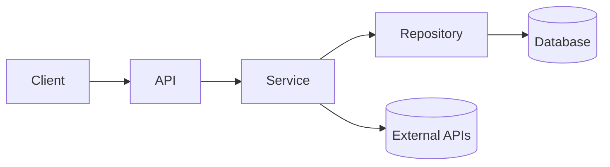

# Architecture

## 1. Overview
<<Two paragraphs: what the system does, its main components, and the style (layered / hexagonal / DDD / MVC / plugin architecture). Say which one explicitly.>>

## 2. Layers and dependency direction
<!-- Agents replicate whatever they see. State the allowed direction and forbid the rest. Pair with a linter rule if possible. -->

| Layer | Folder | May import from | Must not import from |
|---|---|---|---|
| Types / contracts | `<<src/types>>` | — | everything else |
| Config | `<<src/config>>` | types | services, routes |
| Repositories (data access) | `<<src/repositories>>` | types, config | services, routes |
| Services (business logic) | `<<src/services>>` | repositories, types | routes, UI |
| Routes / controllers | `<<src/routes>>` | services, types | repositories directly |
| UI | `<<src/ui>>` | API client only | server code |

Cross-cutting concerns (auth, logging, feature flags, telemetry) enter through one place: `<<src/providers>>`.

## 3. Where things live
| Kind of thing | Location | Naming |
|---|---|---|
| Endpoint | `<<src/routes/<domain>.ts>>` | `<<kebab-case file, verbNoun handler>>` |
| Business rule | `<<src/services/<domain>/>>` | |
| DB access | `<<src/repositories/>>` | |
| Migration | `<<migrations/>>` | `<<timestamp_description>>` |
| Unit test | `<<beside the file, *.test.ts>>` | |
| E2E test | `<<e2e/>>` | |
| Background job | `<<src/jobs/>>` | |
| Script / one-off | `<<scripts/>>` | |

## 4. Key flows
<!-- One short sequence per critical flow (auth, the core transaction, the main pipeline). Mermaid sequence diagrams are fine. -->

## 5. Boundaries and integrations
External systems, what we own vs. what we call, retry/timeout policies.

## 6. Decisions
Link ADRs: `<<docs/adr/>>` or the KB's `decisions/`. Do not restate them here.
