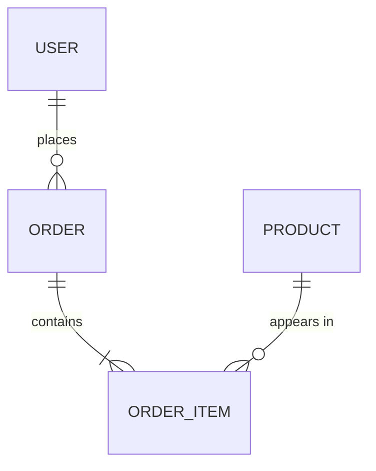

# Data model

<!-- One section per entity, in natural language, then the diagram. Non-technical readers must be able to understand it; agents must be able to write correct queries from it. If the schema is large, cover the core entities here and point to docs/generated/schema.* for the rest. -->

## Conventions
- Primary keys: <<uuid / bigint>>. Timestamps: <<created_at, updated_at in UTC>>. Soft delete: <<deleted_at or none>>.
- Naming: <<snake_case tables, singular/plural?>>.
- Migrations: <<tool>>; never edit a merged migration.

## Entities

### <<Entity name>> (`<<table_name>>`)
**Purpose.** <<What it represents in the business.>>

| Field | Type | Required | Meaning | Validation / rules |
|---|---|---|---|---|
| `id` | uuid | yes | | |
| `<<field>>` | | | | |

**Relationships.** <<belongs to X; has many Y; unique per Z.>>
**Lifecycle.** <<how rows are created, updated, archived.>>
**Gotchas.** <<denormalized fields, legacy columns, things that look wrong but are intentional.>>

### <<Next entity>> …

## Diagram

## Generated references
- `docs/generated/schema.sql` — <<how it is produced, e.g. `pg_dump --schema-only`>>
- Regenerate with: `<<command>>`
