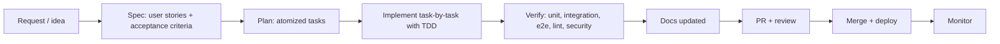

# Workflow — from request to production

<!-- Describe the REAL process, not an ideal one. If a phase has no owner, say "none". Agents follow this literally. -->

## 1. Phases

| Phase | Owner | Input | Deliverable | Excellent means… |
|---|---|---|---|---|
| Spec | <<product / Martin>> | request | `specs/<feature>.md` (user stories, acceptance criteria, out of scope) | every criterion is testable; clarifications recorded |
| Plan | <<top-tier model in plan mode>> | spec | task list, each task ≤ <<2 h>>, with its verification | no task depends on an undecided question |
| Implement | <<agent, mid-tier model>> | one task | code + tests (written first) | follows `*-standards.md`; nothing outside the task |
| Verify | agent + hooks | change | green suite, e2e smoke, lint/type/security clean, coverage report | no skipped tests; no disabled rules |
| Docs | agent | change | updated `docs/*` per `documentation-standards.md` §2 | reviewer finds nothing stale |
| Review | <<Martin / reviewer>> | PR | approval or change requests | reviewer checks spec ↔ diff ↔ tests, not formatting |
| Deploy | <<CI / manual>> | merged main | release | rollback plan known |

## 2. Definition of done (the agent checks every item before saying "done")
- [ ] Spec exists and the task is traceable to a story.
- [ ] Tests written first; full unit suite green; new-code coverage ≥ <<90>>%.
- [ ] Integration tests green; e2e smoke green.
- [ ] Lint, format, type check, security scan clean; no rules disabled.
- [ ] Docs updated per `documentation-standards.md` §2; `api-spec.yml` regenerated if routes changed.
- [ ] Progress file updated; worktree state noted.
- [ ] Commit message per `backend-standards.md` §11; PR description links the spec and lists verification evidence.

## 3. Model policy
| Phase | Model tier |
|---|---|
| Spec, plan, architecture, deep debugging, security, DevOps | top tier (<<Opus / Gemini HIGH / Codex>>) |
| Routine implementation, shallow review, maintenance | mid tier (<<Sonnet / Gemini LOW-MED>>) |

## 4. Git and PR rules
Branch/commit/PR rules live in `backend-standards.md` §11. Summary: one ticket = one branch = one worktree; PR required; everything in §2 green before merge; `--no-verify` is forbidden.

## 5. Session routine (agents)
On start: read `PROGRESS.json`, `git log --oneline -20`, pick the next task, run `<<health check>>`. On end: update `PROGRESS.json`, commit with a descriptive message.

## 6. Escalation
When the spec is ambiguous, the task cannot be verified, or a rule must be broken: stop, write the question in the progress file, ask. Do not guess.
